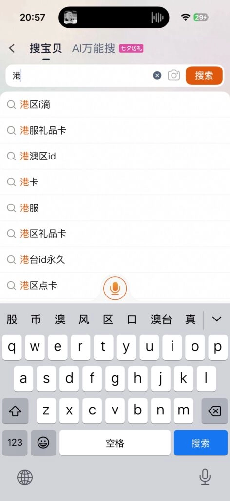
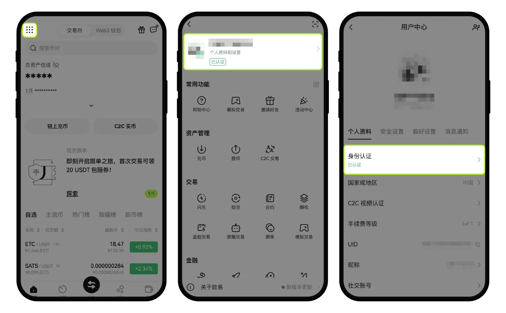
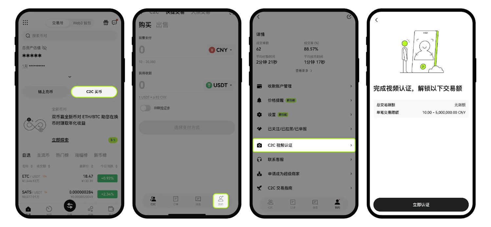

# Complete Guide to OKX Registration Process

Wondering how to get started with one of the world's top crypto exchanges? This guide walks you through the entire OKX registration process, from account setup to identity verification, plus shows you how to unlock trading fee discounts and complete your first deposit.

---

## What You Need Before Starting

Before diving into registration, grab these essentials:

- **Your smartphone** – You'll need it to snap photos of your ID documents
- **Active email address** – This becomes your account login and receives verification codes
- **Valid ID document** – Choose from passport, national ID card, or driver's license

## Step-by-Step Registration Tutorial

Getting your OKX account up and running takes just a few minutes:

First, head to the registration page and select your country or region of residence. Enter your email address and make sure the invitation code shows **47044926** – this unlocks an automatic 20% discount on all trading fees.

Check your inbox for the 6-digit verification code and enter it on the next screen. Then add your mobile number and input the SMS code that arrives moments later.

Create a strong password with at least 8 characters, mixing numbers, letters, and special symbols for maximum security.

## Downloading the Mobile App

**For iOS Users:**

Due to regional restrictions, mainland China's App Store doesn't list the OKX app. Since OKX holds a legitimate trading license in Hong Kong, you'll need to switch to a non-mainland App Store region. You can register your own international Apple ID or acquire one through secondary markets – though handling this yourself is always preferable.

**For Android Users:**

Visit the official website to download the APK file directly and install it on your device. If you're using Xiaomi, Huawei, or other Chinese brand phones, you might need to temporarily disable all network connections during installation.

👉 [Start your trading journey with exclusive fee discounts on OKX](https://www.okx.com/join/47044926)

**Welcome Bonus Opportunity:**

New user acquisition costs exchanges roughly $5-10 per person. After completing registration and verification, you'll receive one mystery box. Complete your first trade to unlock a second mystery box – combined value averages around 7 USDT per user.

## Understanding KYC Identity Verification

KYC stands for "Know Your Customer" – a standard financial industry practice for verifying user identities. The main goals? Preventing money laundering and fraud.

Without completing KYC, your account faces significant restrictions. Different verification levels unlock different trading capabilities.

### Verification Tier Limits

Completing identity verification unlocks corresponding trading permissions. Unverified users cannot deposit, withdraw, or trade through C2C markets.

### Basic Identity Verification Steps

Open the OKX mobile app and tap the icon in the upper left corner. Navigate to **Personal Profile and Settings → Personal Profile → Identity Verification**.

Hit **Verify Now** to enter the verification page. Upload clear photos of your ID document – for example, both sides of your national   ID card.

Complete the facial recognition scan to finish basic identity verification.

### Video Verification Process

From the OKX app homepage, tap **C2C Buy Crypto**. Select **My Profile → C2C Video Verification → Verify Now**.

During video verification, keep sound enabled and camera active – don't connect headphones. The system reads risk disclosures aloud (you don't need to repeat them). After the beep sound, simply answer **"Yes"** when prompted.

Submit your materials and wait for review completion.

## Making Your First Deposit

Once KYC clears, you're ready to fund your account. OKX primarily supports C2C trading with multiple payment methods available.

Before starting C2C transactions, double-check that you've completed basic identity verification – it's mandatory for deposits and withdrawals.

---

## Why Choose OKX for Crypto Trading

OKX stands as one of the world's top three cryptocurrency exchanges, founded in 2017 and headquartered in Seychelles. With comprehensive trading tools, competitive fees, and robust security measures, OKX provides everything you need for successful crypto trading. 👉 [Join OKX today with referral code 47044926 for exclusive benefits](https://www.okx.com/join/47044926)
